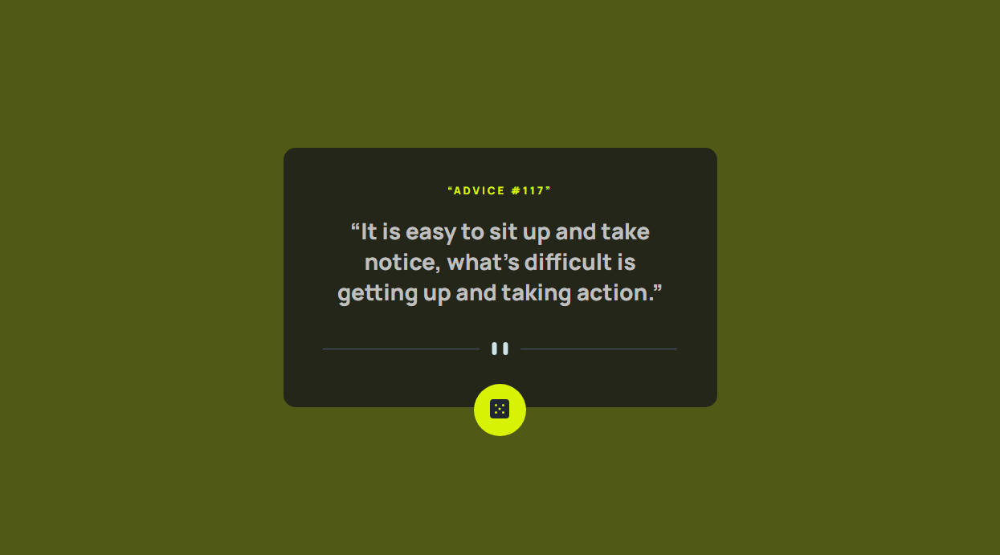
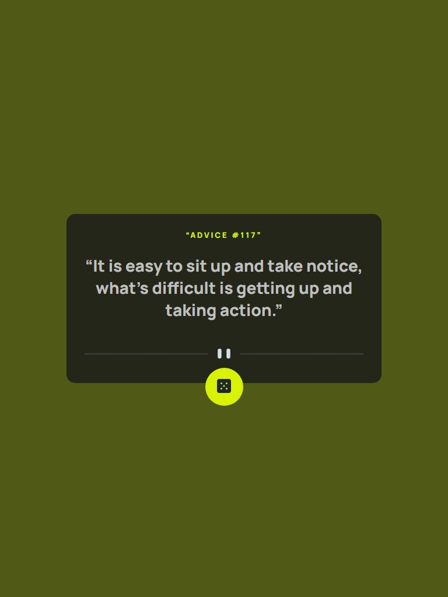

## Advice generator app solution

## Table of contents

- [Overview](#overview)
- [The challenge](#the-challenge)
- [Screenshot](#screenshot)
- [Links](#links)
- [My process](#my-process)
- [Built with](#built-with)
- [Author](#author)

## Overview

This is my solution to the [Advice generator app challenge on Frontend Mentor](https://www.frontendmentor.io/challenges/advice-generator-app-QdUG-13db).

### The challenge

Users should be able to:

- View the optimal layout for the app depending on their device's screen size
- See hover states for all interactive elements on the page
- Generate a new piece of advice by clicking the dice icon

### Screenshot

## Desktop View



## Mobile View


## Tablet View



### Links

- Solution URL: [Solution URL]()
- Live Site URL: [Livesite URL]()

## My process

I built this project using HTML, CSS and JavaScript. To style the page, I used a variety of CSS properties including Flexbox and Position property> I have also made use of CSS variables to store all my constant values in one place e.g colors. For optimal layout viewing depending on the user's screen size, I implemented a @Media rule to handle the styling for different sizes as highlighted in the above screenshots.
I used vanilla javascript to handle the display of advice quotes on button click.

- I set up an Async function to fetch and handle data from the AdviceSlip Free Advice API
- I added an event listener that handles the advice display on button click.

### Built with

I used the following technologies to build this project:

- Semantic HTML5 markup
- CSS custom properties
- Flexbox
- Mobile-first workflow
- Vanilla Javascript
- Fetch API

### A snippet of my JavaScript

```js
async function fetchAdvice() {
  try {
    const response = await fetch("https://api.adviceslip.com/advice");
    if (!response.ok) {
      throw new Error(`Unable to fetch advice. Status ${response.status}`);
    }
    const data = await response.json();
    adviceId.textContent = `${quotationLeft}Advice #${data.slip.id}${quotationRight}`;
    adviceText.textContent = `${quotationLeft}${data.slip.advice}${quotationRight}`;
  } catch (error) {
    console.error(`Error: ${error.message}`);
  }
}
```

## Author

- Name - [Marley](https://www.linkedin.com/in/marley-semende-web-dev/)
- Frontend Mentor - [@Marley-Semende](https://www.frontendmentor.io/profile/Marley-Semende)
- LinkedIn - [Marley](https://www.linkedin.com/in/marley-semende-web-dev/)
