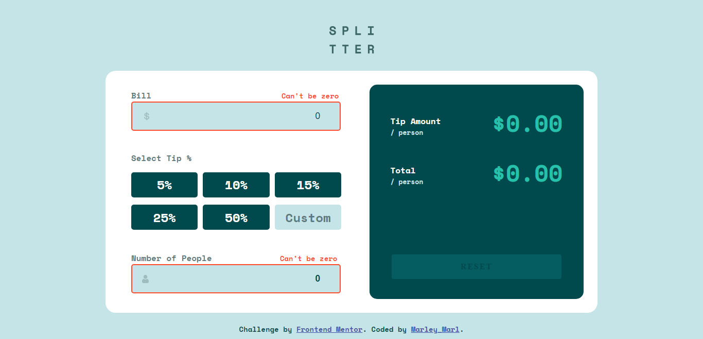

# My Tip calculator app solution

## Table of contents

- [Overview](#overview)
  - [The challenge](#the-challenge)
  - [Screenshot](#screenshot)
  - [Links](#links)
- [My process](#my-process)
  - [Built with](#built-with)
  - [What I learned](#what-i-learned)
- [Author](#author)

## Overview

This is a solution to the [Tip calculator app challenge on Frontend Mentor](https://www.frontendmentor.io/challenges/tip-calculator-app-ugJNGbJUX).

### The challenge

Users should be able to:

- View the optimal layout for the app depending on their device's screen size
- See hover states for all interactive elements on the page
- Calculate the correct tip and total cost of the bill per person

### Screenshot

### Desktop View


### Mobile View


### Avtive States



### Links

- Solution URL: [Solution URL](https://github.com/Marley-Semende/tip-calculator-app)
- Live Site URL: [Live site URL]()

## My process

### Built with

- Semantic HTML5 markup
- CSS custom properties
- Flexbox
- CSS Grid
- Mobile-first workflow
- Vanilla Javascript

### What I learned

### Example Code

```javascript
const calculateTipAmount5 = (button5) => {
  let totalAmount5 =
    (billInputElement.value * (button5 / 100)) / numOfPeopleInput.value;
  tipAmountPerPerson.innerText = `$${totalAmount5.toFixed(2)}`;
  let totalBillFive =
    billInputElement.value / numOfPeopleInput.value + totalAmount5;
  totalAmountPerPerson.innerText = `$${totalBillFive.toFixed(2)}`;
};
const populateCustomButton = () => {
  count++;
  tipButton[5].innerText = `${count}%`;
};
```

## Author

- Name - [Marley]
- Frontend Mentor - [@Marley](https://www.frontendmentor.io/profile/Marley-Semende)
- LinkedIn - [Marley](https://www.linkedin.com/in/marley-semende-web-dev/)
