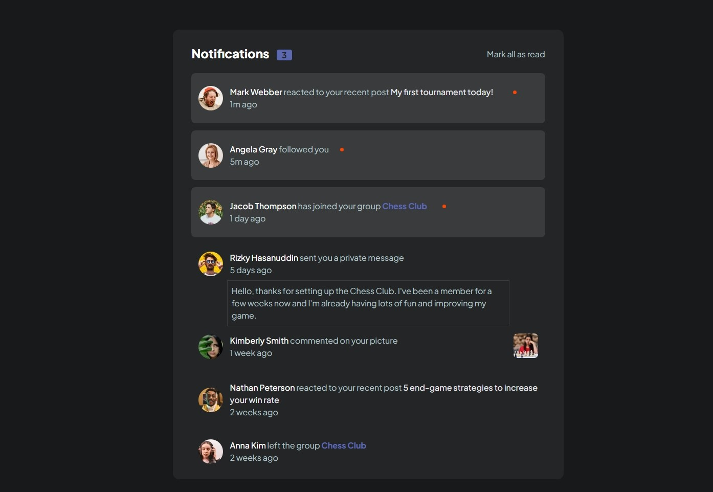

# Notifications page

## Table of contents

- [Overview](#overview)
  - [The challenge](#the-challenge)
  - [Screenshot](#screenshot)
  - [Links](#links)
- [My process](#my-process)
  - [Built with](#built-with)
  - [What I learned](#what-i-learned)
  - [Continued development](#continued-development)
- [Author](#author)

## Overview
This is a solution to the [Notifications page challenge on Frontend Mentor](https://www.frontendmentor.io/challenges/notifications-page-DqK5QAmKbC).

### The challenge
Users should be able to:

- Distinguish between "unread" and "read" notifications
- Select "Mark all as read" to toggle the visual state of the unread notifications and set the number of unread messages to zero
- View the optimal layout for the interface depending on their device's screen size
- See hover and focus states for all interactive elements on the page

### Screenshot
## Desktop


### Links
- Solution URL: [Solution URL](https://your-solution-url.com)
- Live Site URL: [Livesite URL](https://your-live-site-url.com)

## My process
For this project, I started by analyzing the challenge requirements and breaking down the tasks into smaller components. I then began coding the HTML structure, focusing on semantic markup to ensure accessibility and SEO optimization. Once the HTML was in place, I moved on to styling using CSS, utilizing flexbox for layout and positioning elements. I paid close attention to responsive design, implementing a mobile-first approach and utilizing media queries to adjust styles for larger screens.
The most challenging part of the project was implementing the JavaScript functionality to mark notifications as read. I approached this by first selecting the necessary DOM elements and defining variables to keep track of the notification state. Then, I implemented event listeners to handle user interactions, such as clicking on individual notifications or the "Mark all as read" button. Finally, I tested the functionality thoroughly to ensure it worked as expected across different scenarios.

### Built with
- Semantic HTML5 markup
- CSS custom properties
- Flexbox
- Mobile-first workflow
- Vanilla Javascript

### What I learned
While working on this project, I gained a better understanding of managing DOM elements dynamically with JavaScript. Here's a snippet of code I'm particularly proud of:

```js
// JavaScript code snippet
const markAsRead = () => {
  Array.from(unread).forEach(element => {
    element.style.backgroundColor = "#242526";
    counter = 0;
    notificationCount.innerHTML = counter;
  });
  Array.from(notificationDots).forEach(dot => {
    dot.classList.add("hidden");
  })
}
```

### Continued development
In future projects, I aim to further enhance my skills in responsive design and explore more advanced JavaScript functionalities.

## Author
- Name - [Marley](https://www.linkedin.com/in/marley-semende-web-dev/)
- Frontend Mentor - [@Marley](https://www.frontendmentor.io/profile/Marley-Semende)
- LinkedIn - [Marley](https://www.linkedin.com/in/marley-semende-web-dev/)
- LeetCode - [@Marley](https://leetcode.com/MarleySemende/)
