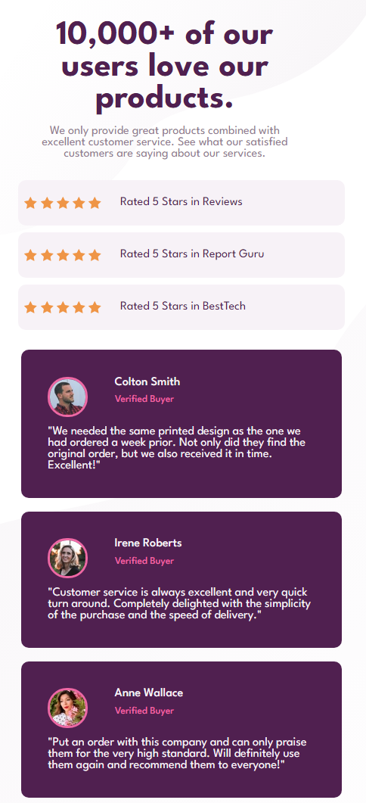

# Product preview card component solution

## Table of contents

- - [The challenge](#the-challenge)
  - [Screenshot](#screenshot)
  - [Links](#links)
  - [My process](#my-process)
  - [Built with](#built-with)
  - [What I learned](#what-i-learned)
- [Author](#author)

### The challenge

Users should be able to:

- View the optimal layout depending on their device's screen size
- See hover and focus states for interactive elements

### Screenshot

## Desktop View


## Mobile View



### Links

- Solution URL: [https://github.com/Marley-Semende/product-preview-card-component]
- Live Site URL: [https://marley-semende.github.io/product-preview-card-component/]

## My process

I used semantic HTML markup and CSS proprties to build this Product Preview Card Component. I created the designs to the following widths:

- Mobile: 375px
- Desktop: 1440px
  and I have used @Media Query to set different layouts based on different screen sizes (375px for Mobile devices) and (1440px for Desktop View).

### Built with

- Semantic HTML5 markup
- CSS custom properties
- Flexbox
- CSS Grid
- Mobile-first workflow
- Pseudo-selectors
- CSS Variables

### What I learned

In this project I learnt how to implement the Mobile-First workflow. I learnt how to work with CSS Grid and CSS Flexbox together to avhieve a responsive layouts. And using Pseudo-Selectors like :hover :active :visited to set states for interactive elements.

```css
:root {
  --cream: #f2ebe3;
  --white: #fff;
  --very-dark-blue: #1c232b;
  --dark-grayish-blue: #6c7289;
  --dark-cyan: #3c8067;
  --darker-cyan: #1f5042;
  --fraunces: "Fraunces", sans-serif;
  --montserrat: "Montserrat", serif;
}
.container {
  width: 40%;
  display: grid;
  grid-template-columns: 1fr 1fr;
}

@media only screen and (max-width: 375px) {
  .container {
    grid-template-columns: 1fr;
    width: 90vw;
    height: auto;
    margin: 5%;
  }
}
```

## Author

- Name - [Marley]
- Frontend Mentor - [@Marley-Semende](https://www.frontendmentor.io/profile/Marley-Semende)
- LinkedIn - [Marley Semende](https://www.linkedin.com/in/marley-semende-web-dev/)
