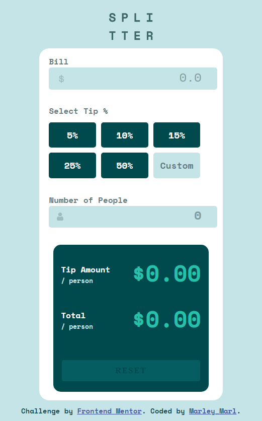

# Order summary card solution

## Table of contents

- [The challenge](#the-challenge)
- [Screenshot](#screenshot)
- [Links](#links)
- [My process](#my-process)
- [Built with](#built-with)
- [What I learned](#what-i-learned)
- [Author](#author)

### The challenge

Users should be able to:

- See hover states for interactive elements

### Screenshot




### Links

- Solution URL: ()
- Live Site URL: ()

## My process

I have made use of HTML and CSS concepts like flexbox, box-sizing, css variables, media queries and pseudo-selectors to build this order summary card.

### Built with

- Semantic HTML5 markup
- CSS
- Flexbox

### What I learned

CSS Variables
Pseudo-Selectors
Flexbox

```css
.subscription-info {
  background-color: var(--very-pale-blue);
  border-radius: 5px;
  margin: 3% 12% 3% 10%;
  padding: 5px;
  display: flex;
  justify-content: space-around;
  text-align: left;
}
```

## Author

- Name - [Name]
- Frontend Mentor - [@Marley-Semende](https://www.frontendmentor.io/profile/Marley-Semende)
- LinkedIn - [Marley Semende](https://www.linkedin.com/in/marley-semende-web-dev/)
