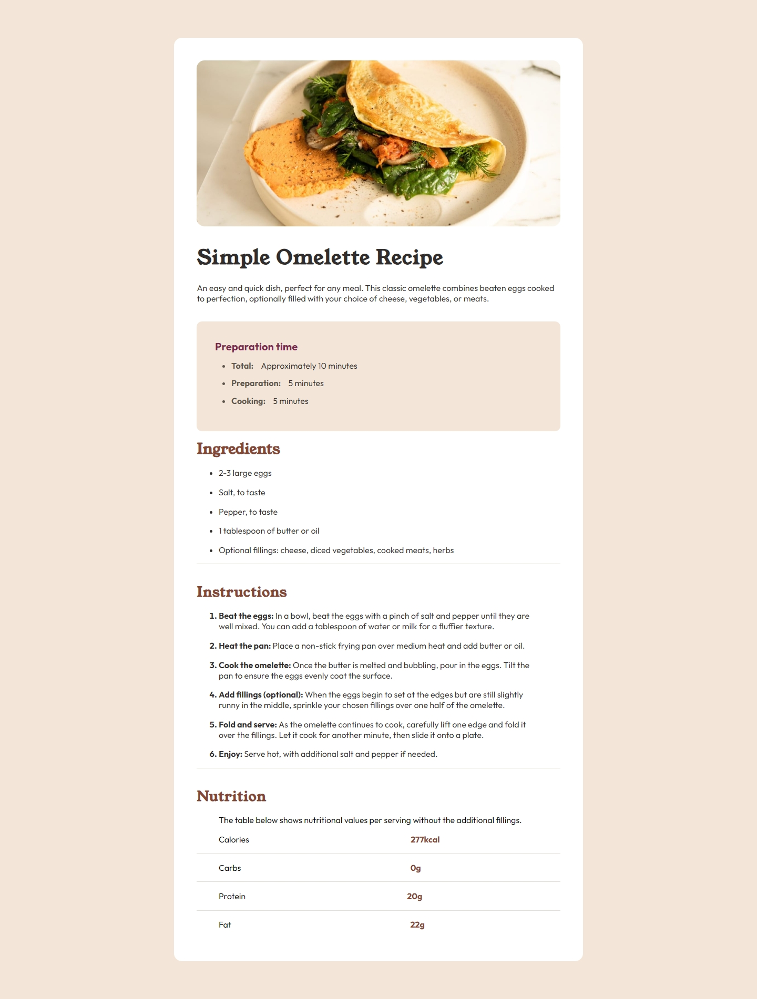

# My Solution to Frontend Mentor - Recipe page solution

## Table of contents

- [Overview](#overview)
  - [The challenge](#the-challenge)
  - [Screenshot](#screenshot)
  - [Links](#links)
- [My process](#my-process)
  - [Built with](#built-with)
  - [What I learned](#what-i-learned)
  - [Continued development](#continued-development)
  - [Useful resources](#useful-resources)
- [Author](#author)

## Overview

This is a solution to the [Recipe page challenge on Frontend Mentor](https://www.frontendmentor.io/challenges/recipe-page-KiTsR8QQKm).  

### Screenshot

### Links

- Solution URL: [Solution URL]()
- Live Site URL: [Live site URL]()

## My process

### Built with

- Semantic HTML5 markup
- CSS custom properties
- Flexbox
- CSS Grid
- Mobile-first workflow

## Author

- Name - [Marley]()
- Frontend Mentor - [@Marley](https://www.frontendmentor.io/profile/Marley-Semende)
- LinkedIn - [Marley](https://www.linkedin.com/in/marley-semende-web-dev/)
